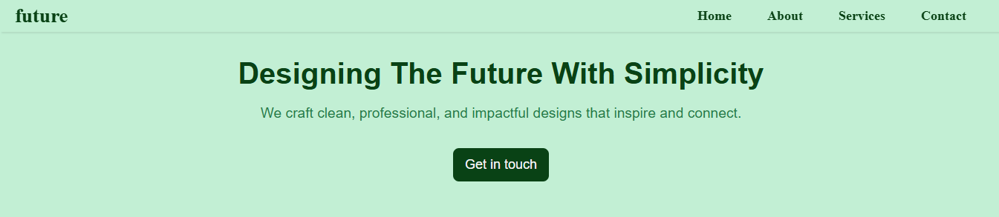
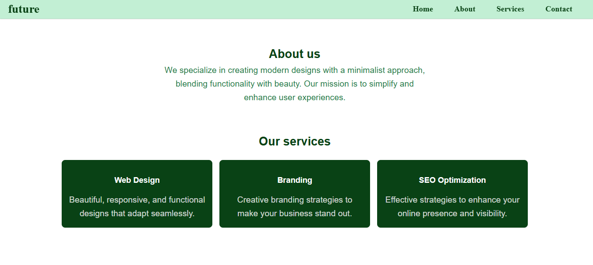
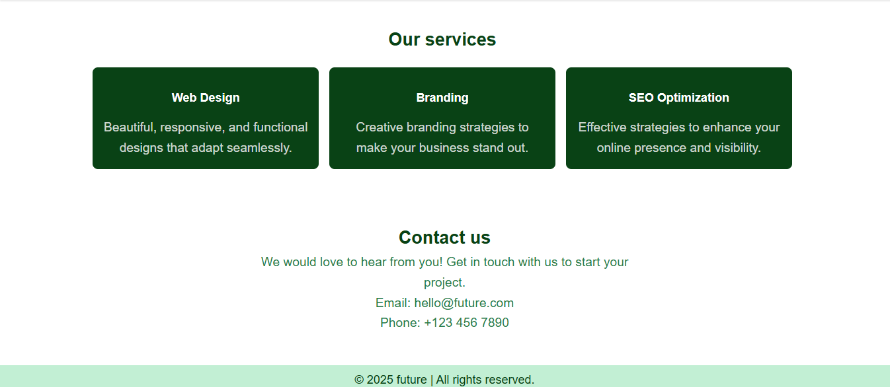

## Simple Design Website

A minimalist, single-page website designed with simplicity in mind. This project demonstrates the use of HTML and CSS to create a clean and responsive design, emphasizing user-friendly navigation and impactful visuals. It was developed as a practice project to enhance HTML and CSS skills.

## Features

- **Responsive Design**: Adapts seamlessly to various screen sizes, including desktops, tablets, and mobile devices.
- **Fixed Navigation Bar**: Ensures easy access to different sections of the page.
- **Hero Section**: Includes a captivating headline and call-to-action button.
- **About Us Section**: Highlights the mission and values of the website.
- **Services Section**: Showcases three key services (Web Design, Branding, and SEO Optimization) with visually appealing cards.
- **Contact Section**: Provides essential contact information for visitors.
- **Footer**: A simple footer with copyright information.

## Technologies Used

- **HTML5**: For structuring the content of the website.
- **CSS3**: For styling and layout, including:
    - Flexbox
    - CSS Grid
    - Media queries for responsiveness

## Screenshots   
# Navigation and Hero Section

# Body section

# Body and footer

## Demo

[Watch the demo video](https://aaronbioo.github.io/futureModified.mp4/)

